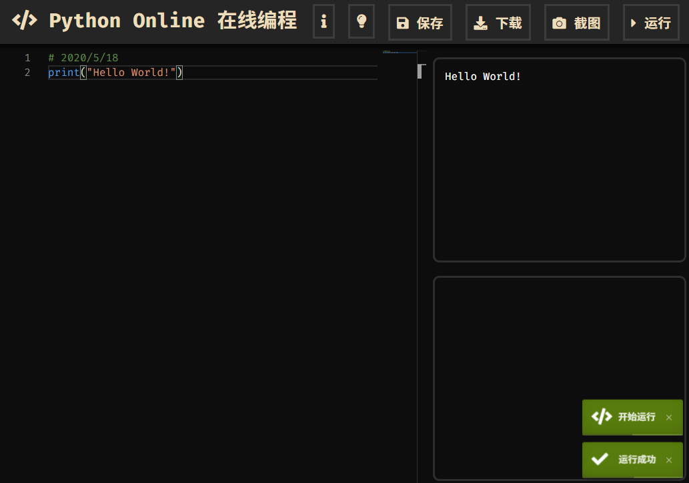

# 在线 Python 编程 (Online Python Interpreter)
## 截图

## 功能
- 适用于 Python 教学
- 编辑 Python 代码，并输出结果（支持 Turtle 海龟图）
- 支持清晰地截图代码及结果
- 支持保存代码（借助cookie，因此有长度限制）和下载代码（``.py``文件需选择保留）
- 静态页面，可以缓存线下使用

## 说明
- Python 的解释器是依靠 [Skulpt](https://github.com/skulpt/skulpt) 使用 Javascript 模拟的，有可能和 CPython 有区别。
- 界面写的比较丑，一是不会设计，二是不熟悉css = =

## 感谢

- [Skulpt](https://github.com/skulpt/skulpt)
- [html2canvas](https://github.com/niklasvh/html2canvas)
- [Monaco Editor](https://microsoft.github.io/monaco-editor/)

## (F)AQ（因为没人问）
**Q:** 你这个 xx 按钮/xx 提示框 怎么被 盖住了/错位了？

**A:** 技术不精，很有可能我不会改= =  建议在正常大小的窗口（比如全屏）下使用。不过有这方面问题欢迎提交 Issue 和 PR

**Q:** 我的代码怎么保存的？怎么不用登录？

**A:** 用 [Cookie](https://baike.baidu.com/item/cookie/1119) 保存的，长度限制大概为 `4000` 字节，再加上 `base64`  对长度的负优化（大概？），因此只能保存 `50` 行左右的代码，有效期为 `10` 天。 

**Q:** 我按了按钮没反应？

**A:** 请使用**极为先进**的主流浏览器的最新版，比如 [新版 Edge 浏览器](https://www.microsoft.com/zh-cn/edge) 或者 [Chrome 浏览器](https://www.google.cn/intl/zh-CN/chrome/)，还有 [Firefox 浏览器](http://www.firefox.com.cn/)。

**Q:** 加载太慢了！

**A:** 网络环境不好 ¯\\_(ツ)_/¯

**Q:** 我的代码和截图保存到哪里了？

**A:** 你浏览器默认的下载文件夹。

**Q:** 这玩意怎么写的？

**A:** 把一大堆开源项目缝起来的。